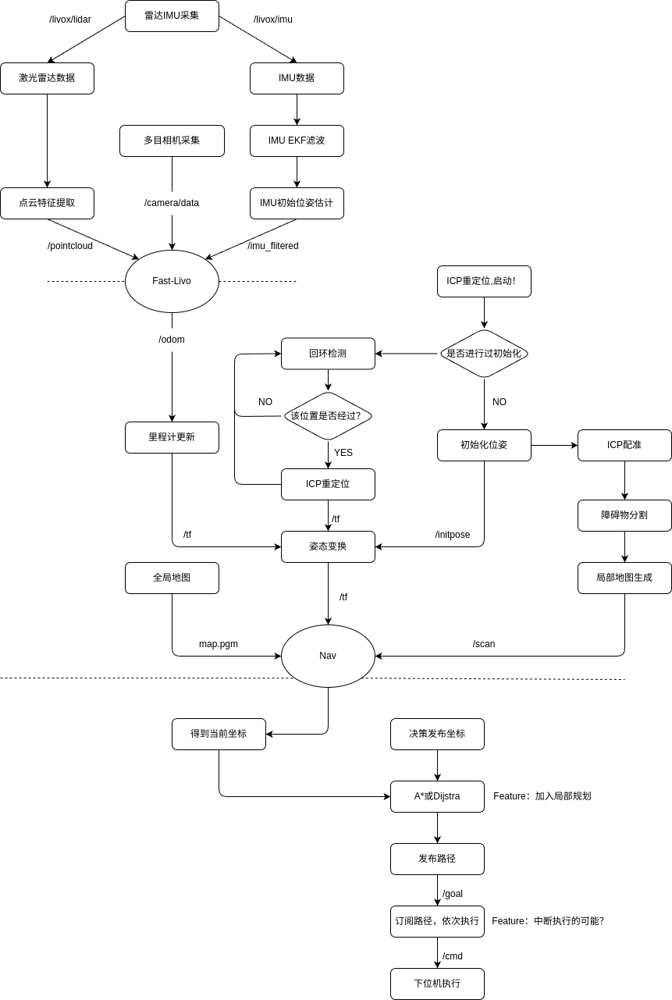

# HDU-Sentinel-Nav

HDU Phoenix战队导航小登的算法仓库。小登只是代码的搬运工，不喜勿喷。

**该项目高度参考了以下开源项目**：

**中南大学FYT机器人战队**：
https://github.com/baiyeweiguang/CSU-RM-Sentry

**深圳北理莫斯科大学北极熊战队**：
https://gitee.com/SMBU-POLARBEAR/pb_rmsimulation

**本项目思路参考华农的方案，感谢他们在青工会的分享**：
https://www.bilibili.com/video/BV1yf421q7tm

大家都是源神！

**思路介绍**
- 使用POINT-LIO获得3D里程计
- 使用ICP进行重定位
  > 在开始使用ICP进行点云配准，重定位,并启动建图
    > 使用linefit_ground_segmentation对MID360的点云进行分割，分割为地面和障碍物
    >将障碍物的点云从PointCloud2压缩为LaserScan，输入Nav2
- 用Nav2进行导航
  > 采用Dijkstra算法进行全局规划
- 通过Ros话题进行通信

```sh
src
│
├──communicate
│   └── rm_bringup
│
├── driver     
│   └── livox_ros_driver2
│
├── localization                
│   ├── point_lio
│   └── icp_localization_ros2
│
├── navigation
│
├── perception
│   ├── linefit_ground_segmentation_ros2
│   └── pointcloud_to_laserscan
│
└── driver     
    └── livox_ros_driver2
mapping.sh
test.sh
```
目前只做了这么些，还在搭积木ing
## 2. 规划

**框架**
|未来规划基本框架|
|-|
||

- 获取先验地图，通过SW文件进行cloudcompare提取表面点云，得到离线场地文件(.pcd)
- 使用EKF处理IMU原始数据
- 使用Fast-Livo计算里程计（等开源ing）
- 启动基于路径的ICP回环检测
- 增加局部规划（exploration等）融合
- 更改导航逻辑，增加打断施法可能（）？
- 增加决策，基于决策优先级选取导航可能（）？
- 增加中间决策层，规划模式选择？参数选择？
- 优化ICP算法 （GICP）
- 双雷达可能性？（没经费呜呜）
- 

## 3. 依赖

- **系统**
  - Ubuntu 22.04
  - ROS Humble (desktop-full)
- **库**
  - [LIVOX-SDK2](https://github.com/Livox-SDK/Livox-SDK2)
  - libpcl-ros-dev
  - eigen、pcl、opoencv、ceres等

## 4. 硬件

- **Mini PC** 
    - 派勤不知名小电脑
- **传感器**
    - Livox MID-360

## 5. quick start